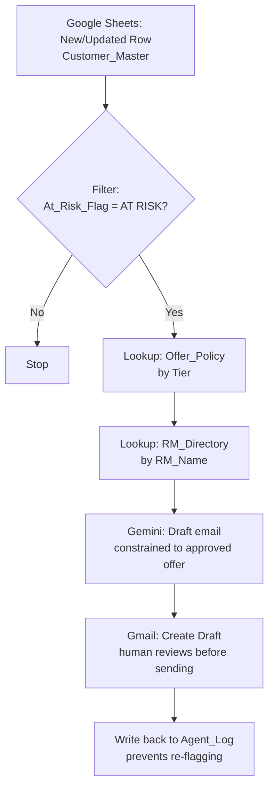

# BankCo Churn-Prediction Agent

A no-code AI agent, built in Zapier, that helps bank Relationship Managers catch at-risk premium customers before they leave — and drafts a policy-compliant retention email for them, with a human always making the final call.

**Role:** AI Product Manager (design, data modeling, build, and testing)
**Stack:** Google Sheets, Zapier, Google AI Studio (Gemini), Gmail
**Status:** Fully built and tested end-to-end. Not published live — see [Known Limitations](#known-limitations).

---

## The Problem

Relationship Managers at a bank each manage dozens of premium customers. It's hard to notice, on your own, when a customer is quietly disengaging — spending less, skipping perks, giving low satisfaction scores — until they don't renew. This agent does that noticing automatically, and hands the RM a ready-to-review email instead of a blank page.

## What It Does

1. Watches a Google Sheet of customer data (spend, lounge usage, app logins, NPS scores)
2. Calculates a transparent **Risk Score** using a plain spreadsheet formula — no black box
3. When a customer crosses the risk threshold, filters them through
4. Looks up **exactly what offer that customer's tier is allowed to receive**, from a strict policy table
5. Looks up the assigned RM's contact details
6. Asks an AI model to draft a warm, personalized retention email — constrained to only mention the approved offer
7. Creates the email as a **draft** in the RM's Gmail — never sends it automatically
8. Logs the action so the same customer isn't re-flagged every week

## Architecture

## Why These Design Choices

**The risk score lives in the spreadsheet, not hidden in Zapier logic.**
Anyone — RM, compliance, auditor — can open the sheet and see exactly why a customer was flagged: a plain formula adding points for spend drop, lounge visit decline, low NPS, low app usage, and renewal proximity. Nothing is a black box.

**Offer eligibility comes from a locked-down policy table, not a prompt instruction.**
The AI is given the customer's tier-appropriate offer as a *data lookup result*, not asked to "come up with something reasonable." This makes fabricated discounts structurally impossible rather than merely discouraged — a meaningful distinction in a regulated industry like banking.

**The agent drafts. It never sends.**
This was the single most important decision in the build. `Gmail: Create Draft` was used instead of `Gmail: Send Email` throughout. A human is always the last checkpoint before any offer reaches a real customer.

**A write-back log gives the agent memory.**
Without logging what's already been actioned, the same Zap would re-flag and re-draft for the same customer every single week. The log is what makes this an *agent* with state, not a one-shot script.

## The Data Model

Six tabs in one Google Sheet act as the single source of truth:

| Tab | Purpose |
|---|---|
| `Customer_Master` | Core profile + live, formula-driven Risk_Score and At_Risk_Flag |
| `Transaction_Behavior` | Spend trends, feeding the risk calculation |
| `Engagement_Signals` | Lounge visits, app logins, support tickets |
| `NPS_Survey` | Satisfaction scores and comments |
| `Offer_Policy` | The guardrail — exactly what each tier is allowed to be offered |
| `RM_Directory` | RM contact info |
| `Agent_Log` | Write-back log of every action taken |

Full sheet: [`source-sheet/BankCo_ChurnAgent_SourceSheet.xlsx`](./source-sheet/BankCo_ChurnAgent_SourceSheet.xlsx)

## Proof of Work — Every Step, Tested

Each step below was individually configured and test-executed in Zapier before moving to the next. Screenshots are real test output, not mockups.

| Step | What it does | Evidence |
|---|---|---|
| 1. Trigger | Fires on any new/updated row in `Customer_Master` | [Screenshot](./screenshots/01-trigger-working.png) |
| 2. Filter | Only continues if `At_Risk_Flag` contains "AT RISK" | [Screenshot](./screenshots/02-filter-working.png) |
| 3. Lookup — Offer_Policy | Matches customer's Tier to their approved offer | [Screenshot](./screenshots/03-rm-lookup.png) |
| 4. Lookup — RM_Directory | Retrieves the assigned RM's email | [Screenshot](./screenshots/03-rm-lookup.png) |
| 5. AI draft (Gemini) | Writes the email, constrained to the approved offer | [Prompt](./screenshots/04-ai-prompt-built.png) · [Successful output](./screenshots/06-ai-draft-success.png) |
| 6. Gmail — Create Draft | Places the email as a draft, never auto-sent | [Screenshot](./screenshots/07-gmail-draft-config.png) |
| 7. Write-back | Logs the action to `Agent_Log` | [Screenshot](./screenshots/08-agent-log-writeback.png) |

**Sample AI output** (Silver-tier customer, no fee waiver eligible under policy):

> *"Dear Rahul, I hope this email finds you well. As your Relationship Manager at BankCo, I wanted to personally reach out and express my sincere gratitude for your continued partnership with us over the years... As a valued client, I would like to invite you to take advantage of a complimentary relationship review call..."*

Note what it does *not* do: it doesn't mention a fee waiver (correctly, since Silver tier has 0% eligibility per policy), and it doesn't expose the raw churn signals (spend drop, lounge visits) that triggered the flag — which would read as surveillance rather than care.

## Known Limitations

- **Not published live.** Zapier's free tier caps Zaps at 2 steps; this build has 7. Every step is individually built and tested (see table above), but the full chain has not run unattended on a schedule. Running it live would require Zapier's Professional plan (~$20–30/month).
- **Test data only.** The sheet uses fictional customers. No real customer data was used at any point.
- **Gmail draft currently addressed to the builder's own inbox**, not real customers — intentional, for safe testing.
- **Looping by Zapier was deliberately avoided** in the final design after early testing showed its data-reference UI to be unreliable (see [Build Notes](./docs/03-build-notes-and-lessons.md)); the design instead uses a per-row Google Sheets trigger, which proved far more stable.

## Repo Contents

- [`docs/01-design-blueprint.md`](./docs/01-design-blueprint.md) — full technical design spec (schema, risk formula, edge cases, prompt design)
- [`docs/02-simple-explanation.md`](./docs/02-simple-explanation.md) — the same design in plain-English form
- [`docs/03-build-notes-and-lessons.md`](./docs/03-build-notes-and-lessons.md) — what actually happened during the build, including debugging the Loop step and the pivot to a simpler trigger
- [`source-sheet/`](./source-sheet/) — the working Google Sheets file, formulas included
- [`screenshots/`](./screenshots/) — real test evidence from each build step

## Skills Demonstrated

- **Data modeling** — structuring messy business signals into a clean, auditable schema
- **Business logic design** — a transparent, explainable risk-scoring formula instead of a black box
- **AI orchestration with guardrails** — constraining an LLM's output using a policy lookup table rather than trusting instructions alone
- **Human-in-the-loop judgment** — deliberately choosing "draft" over "send" as a core safety decision, not an afterthought
- **Debugging a no-code tool under real constraints** — diagnosing a Beta feature's data-reference bug, redesigning around it, and documenting the trade-off honestly rather than hiding it
